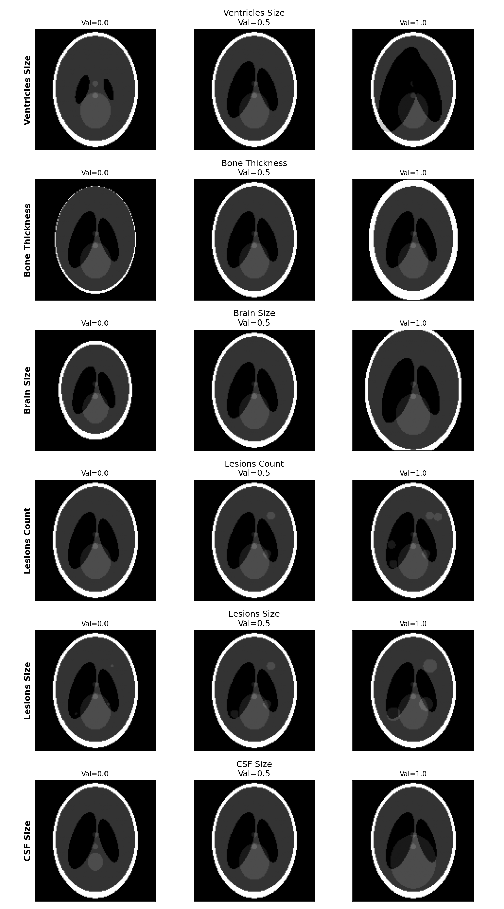

Shepp-Logan Phantom Data Generator
===================================

**Forked from https://github.com/mckib2/phantominator**

This NLeSC fork is streamlined for generating synthetic Shepp-Logan phantom datasets for AI training.

Installation
============

.. code-block:: bash

    git clone https://github.com/NLeSC-Knowledge-Development/SLphantom-generator
    cd SLphantom-generator
    pip install -e .

Usage
=====

Open the Jupyter notebook:

.. code-block:: bash

    jupyter notebook phantominator/examples/shepp_logan.ipynb

The notebook contains examples and a data generation workflow to create synthetic brain phantom images with variations for training neural networks.

About
=====

Simplified Python package for generating Shepp-Logan phantom images. This fork focuses on:

- CT-style phantom generation
- Batch data generation with anatomical variations
- LoRA dataset format (images + metadata.jsonl)
- Easy-to-use Jupyter notebook interface

    # CT phantom
    from phantominator import shepp_logan
    ph = shepp_logan(128)

    # MR phantom (returns proton density, T1, and T2 maps)
    M0, T1, T2 = shepp_logan((128, 128, 20), MR=True)

The Shepp-Logan 3D phantom has ellipsoids in [-1, 1] along the z-axis.
The 2D Shepp-Logan exists at z=-0.25, so if we want just a subset
along the z-axis with the first slice being the traditional 2D
phantom, we can use the `zlims` option:

Core Functions
==============

.. code-block:: python

    from phantominator import shepp_logan

    # Generate a simple CT phantom
    ph = shepp_logan(128, modified=True)

    # Generate a 3D phantom
    ph = shepp_logan((128, 128, 20), zlims=(-.5, .5))

    # Get ellipse parameters for customization
    ph, E = shepp_logan(128, modified=True, ret_E=True)

See the notebook for detailed examples of batch generation with anatomical variations.

Controlled Data Generation
==========================

The notebook ``phantominator/examples/shepp_logan.ipynb`` includes a specialized generator for creating training datasets with controlled anatomical features.

You can modify the following 6 parameters specifically via the prompt or configuration:

1. **Ventricles Size**: Controls the scale of the lateral ventricles (Ellipses 2 & 3).
2. **Bone Thickness**: Adjusts the thickness of the outer skull layer (Gap between Ellipse 0 & 1).
3. **Brain Scale**: Scales the overall brain size (white/gray matter area).
4. **Number of Lesions**: Randomly adds 0 to 5 lesions (bright spots) in valid brain areas.
5. **Lesion Size**: Scales the size of the generated lesions.
6. **CSF Size**: Scales the central cerebrospinal fluid structure (Ellipse 4).

.. image:: phantominator/examples/SL-annotated.jpg
   :alt: Annotated Shepp-Logan phantom with simple example anatomical fearures.
   :align: center

In addition to these controlled features, the generator applies **random affine transformations** (global rotation/translation and local element jitter) to ensure dataset diversity and realism.

Example Prompt
--------------

The generator produces captions in ``metadata.jsonl`` that reflect the controlled parameters. An example caption looks like:

    "Synthetic Shepp-Logan phantom with large ventricles, normal skull bone, normal brain area, 3 lesions, small lesions, large CSF"

License
=======

See LICENSE file (original MIT license from mckib2/phantominator).
